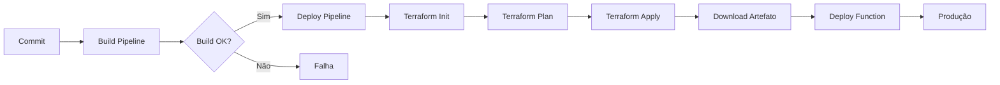

# CI/CD - Azure DevOps Pipelines

## Visão Geral

O projeto utiliza **Azure DevOps Pipelines** para build e deploy automatizado. A arquitetura segue o padrão de pipelines separados para Build e Deploy.

## Localização dos Arquivos

```
pipelines/
├── config.yml              # Variáveis compartilhadas
├── build-function.yml      # Pipeline de Build
├── deploy-function.yml     # Pipeline de Deploy (inclui Terraform)
└── terraform-function/     # Infraestrutura como código
```

## Pipelines

### 1. Build Pipeline (`build-function.yml`)

**Nome no Azure DevOps**: `FinOps-Back-build-function`

**Trigger**: Manual (comentado)

**Estágios**:
1. Restore de pacotes NuGet (Feed_NAP + NuGet.org)
2. Build em Release
3. Publish do artefato
4. Upload do artefato zipado

**Artefato Gerado**: `FinOpsBuildFunction.zip`

```yaml
stages:
  - stage: 'Build_function'
    jobs:
    - job: 'Build'
      steps:
      - task: NuGetToolInstaller@1
      - task: DotNetCoreCLI@2 (restore)
      - task: DotNetCoreCLI@2 (build)
      - task: DotNetCoreCLI@2 (publish)
      - publish: artifact
```

### 2. Deploy Pipeline (`deploy-function.yml`)

**Nome no Azure DevOps**: `FinOps-Back-deploy-function`

**Trigger**: Automático após Build

**Dependências**:
- Pipeline: `FinOps-Back-build-function`
- Repository: `DevOps` (templates v4.2.0)

**Estágios**:
1. Install Terraform 1.9.3
2. Terraform Init (backend remoto)
3. Terraform Plan
4. Terraform Apply
5. Download do artefato de build
6. Deploy da Function App

```yaml
stages:
  - stage: "Deploy_function"
    jobs:
    - job: DeployFunction
      steps:
      - task: TerraformInstaller@1
      - task: TerraformTaskV4@4 (init)
      - task: TerraformTaskV4@4 (plan)
      - task: TerraformTaskV4@4 (apply)
      - download: FinOps-Back-build-function
      - task: AzureFunctionApp@1 (deploy)
```

## Configuração (`config.yml`)

```yaml
variables:
  ArtifactName: 'FinOpsBuildFunction'
```

## Variable Groups (Azure DevOps)

### 1. `FinOps-func-Personal`
Configurações específicas do FinOps:

| Variável | Descrição | Status |
|----------|-----------|--------|
| `NomeAplicacao` | Nome da aplicação (finopsplatform) | ✅ Obrigatório |
| `Setor` | Setor/time (nap) | ✅ Obrigatório |
| `ServiceConnection` | Service Connection Azure | ✅ Obrigatório |

> **Nota:** As variáveis `Enable*Analyzer`, `CostAnalysisSchedule`, `DailySummarySchedule` e `RESULTS_CONTAINER_NAME` foram migradas para o Terraform. Não são mais necessárias no Variable Group.

### 2. `Terraform`
Configurações do Terraform:

| Variável | Descrição |
|----------|-----------|
| `TerraformAccessKey` | Access Key do Storage state |

## Agent Pool

```yaml
pool: azp-personal-full-01
```

Pool self-hosted com:
- .NET 8 SDK
- Azure Functions Core Tools
- Terraform 1.9.3
- Azure CLI

## Fluxo de Deploy



## Terraform no Pipeline

### Init
```yaml
- task: TerraformTaskV4@4
  inputs:
    command: "init"
    backendType: azurerm
    backendServiceArm: "$(ServiceConnection)"
    backendAzureRmResourceGroupName: 'terraform-rg'
    backendAzureRmStorageAccountName: "personalterraformstate"
    backendAzureRmContainerName: "nap"
    backendAzureRmKey: "finops/$(NomeAplicacao).tfstate"
    commandOptions: '-backend-config="access_key=$(TerraformAccessKey)"'
```

### Plan
```yaml
- task: TerraformTaskV4@4
  inputs:
    command: 'plan'
    commandOptions: '-input=false -var "aplicacao=$(NomeAplicacao)" -var "setor=$(Setor)"'
```

### Apply
```yaml
- task: TerraformTaskV4@4
  inputs:
    command: 'apply'
    commandOptions: '-input=false -var "aplicacao=$(NomeAplicacao)" -var "setor=$(Setor)"'
```

## Deploy da Function

```yaml
- task: AzureFunctionApp@1
  inputs:
    azureSubscription: '$(ServiceConnection)'
    appType: 'functionAppLinux'
    appName: '$(NomeAplicacao)-$(Setor)-func'
    package: "$(Pipeline.Workspace)/.../*.zip"
    # App Settings são gerenciados via Terraform
```

> **Importante:** Todas as App Settings estão centralizadas no Terraform (`azurerm_function_app.tf`). O pipeline não precisa mais passar configurações via `appSettings`.

## Configurações Gerenciadas via Terraform

As seguintes configurações estão definidas no [azurerm_function_app.tf](../../pipelines/terraform-function/azurerm_function_app.tf):

| Setting | Descrição |
|---------|-----------|
| `CostAnalysisSchedule` | CRON para análise (3:00 AM UTC) |
| `DailySummarySchedule` | CRON para resumo (6:00 AM UTC) |
| `RESULTS_CONTAINER_NAME` | Container para resultados (`finops-analysis`) |
| `ServiceBusConnection` | Conexão com Service Bus |
| Runtime settings | `FUNCTIONS_WORKER_RUNTIME`, etc. |

## Boas Práticas

### 1. Nunca Execute Terraform Localmente
O state é gerenciado pelo pipeline. Execuções locais podem corromper o state.

### 2. Teste Primeiro no Plan
O pipeline publica o plan para revisão antes do apply.

### 3. Variable Groups
- Sempre use Variable Groups para secrets
- Marque secrets como "secret" no Azure DevOps

### 4. Service Connection
- Use Service Principals com escopo mínimo
- Rotacione secrets periodicamente

## Troubleshooting

### Build Falha no Restore
```bash
# Verificar se o Feed_NAP está acessível
# Verificar se o NuGet.org está acessível
```

### Deploy Falha no Terraform
```bash
# Verificar se o TerraformAccessKey está correto
# Verificar se o ServiceConnection tem permissões
# Verificar logs do Terraform plan
```

### Deploy Falha na Function
```bash
# Verificar se a Function App existe
az functionapp show --name "finopsplatform-nap-func" \
  --resource-group "finopsplatform-nap-rg"

# Verificar se o artefato foi gerado corretamente
# Verificar logs do deploy
```

### Verificar Health da Function
```bash
curl https://finopsplatform-nap-func.azurewebsites.net/api/health
```

## Extensões do Pipeline

### Adicionar Novo Analyzer
1. Adicionar variável no Variable Group `FinOps-func-Personal`
2. Adicionar no deploy-function.yml no `appSettings`
3. Implementar lógica no código

### Adicionar Novo Ambiente
1. Criar novo Variable Group (ex: `FinOps-func-Producao`)
2. Criar branch de configuração
3. Atualizar o backend.tf com novo key
