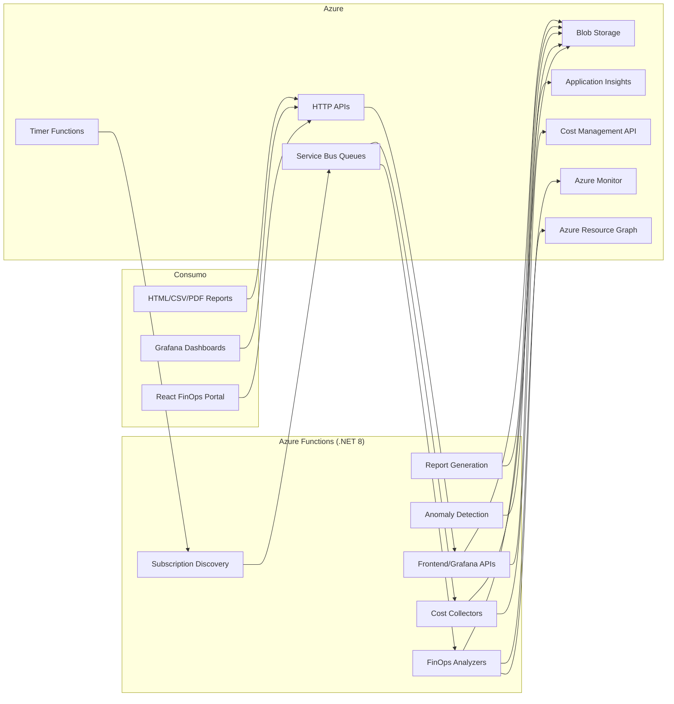
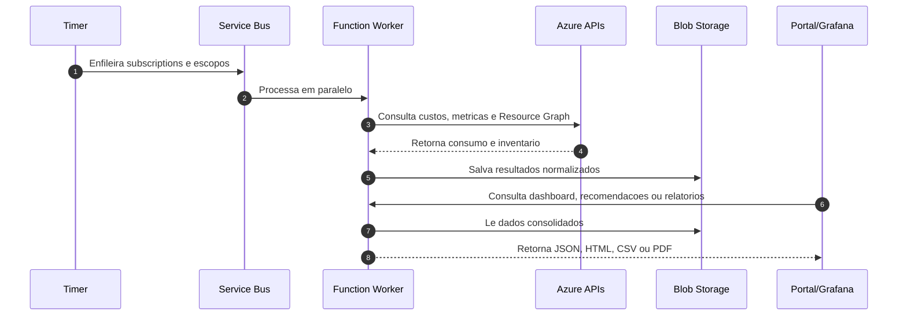

# Azure FinOps Platform

Plataforma FinOps para Azure criada como projeto de portfolio pessoal. O objetivo e demonstrar uma arquitetura serverless capaz de coletar custos reais, executar analises de otimizacao, detectar anomalias e expor os resultados em API, dashboard web, Grafana e relatorios pre-gerados.

Todos os nomes, dominios, e-mails, pools de agente e dados corporativos foram removidos. Os exemplos deste README usam valores ficticios.

## Visao Geral

- Backend em Azure Functions isolated worker com .NET 8.
- Processamento assíncrono com Service Bus para analisar multiplas subscriptions em paralelo.
- Coleta de custos via Azure Cost Management API, com armazenamento historico em Blob Storage.
- Analyzers para recursos ociosos, subutilizados ou sem dono.
- Frontend React/Vite para dashboard, recomendacoes, anomalias, ownership e relatorios.
- Relatorios HTML/CSV/PDF pre-gerados para reduzir latencia em consultas recorrentes.
- Terraform e pipelines de CI/CD para backend e frontend.
- Testes unitarios cobrindo analyzers, servicos e endpoints principais.

## Arquitetura



## Fluxo de Dados



## Funcionalidades

| Area | Implementacao |
|------|---------------|
| Custo por servico | Coleta diaria por subscription e servico, com tendencia historica. |
| Custo por recurso | Coleta granular para associar gasto a recursos especificos. |
| Recomendacoes FinOps | Identifica discos orfaos, IPs publicos sem uso, VMs ociosas, App Services e Storage Accounts subutilizados. |
| Anomalias | Analisa variacao diaria de custo e sinaliza desvios relevantes. |
| Ownership | Relaciona times e subscriptions para relatorios por area responsavel. |
| Relatorios | Gera HTML pre-renderizado, CSV e PDF a partir dos achados consolidados. |
| Grafana API | Endpoints otimizados para paineis externos. |
| Portal web | Dashboard React com paginas de custos, recomendacoes, anomalias, ownership e relatorios. |

## Estrutura

```text
src/
  Personal.FinOpsApi.AzureFunctions/
    Analyzers/      # Regras de otimizacao de recursos Azure
    Functions/      # Timers, filas e APIs HTTP
    Models/         # Contratos de entrada, saida e armazenamento
    Services/       # Cost Management, Blob, relatorios, anomalias e observabilidade
frontend/
  finops-portal/    # React + Vite
pipelines/
  terraform-function/
  terraform-frontend/
docs/
tests/
```

## Exemplos Ficticios

### Resumo de custos

| Indicador | Valor |
|-----------|-------|
| Custo mensal analisado | R$ 84.320,00 |
| Economia potencial | R$ 13.870,00 |
| Subscriptions analisadas | 12 |
| Recursos avaliados | 1.438 |
| Recomendacoes abertas | 47 |

### Recomendacoes

| Tipo | Recurso | Evidencia | Economia estimada |
|------|---------|-----------|-------------------|
| Disco orfao | `disk-vm-lab-001` | Sem VM associada ha 21 dias | R$ 184,00/mes |
| VM ociosa | `vm-batch-dev-02` | CPU media menor que 3% em 14 dias | R$ 620,00/mes |
| App Service | `asp-internal-tools` | CPU menor que 5% e baixa memoria | R$ 410,00/mes |
| Public IP | `pip-old-gateway` | IP sem associacao ativa | R$ 32,00/mes |

### Anomalias

| Data | Servico | Variacao | Hipotese |
|------|---------|----------|----------|
| 2026-05-12 | Azure SQL Database | +38% | Aumento de DTU durante carga pontual |
| 2026-05-18 | Azure App Service | +24% | Scale-out acima do padrao diario |

## Endpoints Principais

| Endpoint | Uso |
|----------|-----|
| `GET /api/SystemHealth` | Health check operacional. |
| `GET /api/GrafanaCostByService?date=YYYY-MM-DD&subscription=all` | Custo por servico no dia. |
| `GET /api/GrafanaCostTrendByService?from=YYYY-MM-DD&to=YYYY-MM-DD` | Serie historica por servico. |
| `GET /api/report/html?date=YYYY-MM-DD` | Relatorio HTML geral. |
| `GET /api/report/html?date=YYYY-MM-DD&subscription={id}` | Relatorio por subscription. |
| `GET /api/report/html?date=YYYY-MM-DD&team={id}` | Relatorio por time. |

## Timers

| Horario UTC | Timer | Descricao |
|-------------|-------|-----------|
| 09:10 | `CostByServiceDailyTimer` | Coleta custos por servico do dia anterior. |
| 09:20 | `CostByResourceDailyTimer` | Coleta custos por recurso. |
| 09:30 | `CostAnalysisTimer` | Executa analyzers de otimizacao. |
| 11:00 | `CostAnomalyDailyTimer` | Detecta anomalias de custo. |
| 11:30 | `DailySummary` | Consolida resumo diario. |
| 12:00 | `PreGeneratedReportTimer` | Pre-gera relatorios HTML. |

## Como Rodar Localmente

Pre-requisitos:

- .NET SDK 8
- Azure Functions Core Tools v4
- Node.js 20+
- Azurite ou uma connection string valida em `AzureWebJobsStorage`
- Permissoes Azure: `Reader`, `Monitoring Reader`, `Cost Management Reader` e `Storage Blob Data Contributor`

Backend:

```bash
dotnet restore src/Personal.FinOpsApi.AzureFunctions/Personal.FinOpsApi.AzureFunctions.csproj
dotnet build src/Personal.FinOpsApi.AzureFunctions/Personal.FinOpsApi.AzureFunctions.csproj
func start --script-root src/Personal.FinOpsApi.AzureFunctions
```

Frontend:

```bash
cd frontend/finops-portal
npm install
npm run dev
```

Testes:

```bash
dotnet test FinOpsApi-Backend.sln
```

## Configuracao

Use `src/Personal.FinOpsApi.AzureFunctions/local.settings.sample.json` como base para ambiente local.

Variaveis mais relevantes:

- `AzureWebJobsStorage`
- `FUNCTIONS_WORKER_RUNTIME=dotnet-isolated`
- `ServiceBusConnection`
- `AZURE_SUBSCRIPTION_ID`
- `COST_SUBSCRIPTIONS`
- `COST_STORAGE_CONTAINER`
- `RESULTS_CONTAINER_NAME`
- `CostByServiceDailySchedule`
- `CostByResourceDailySchedule`
- `CostAnalysisSchedule`
- `CostAnomalyDailySchedule`
- `DailySummarySchedule`
- `ReportGenerationSchedule`

## Infraestrutura

O diretorio `pipelines/terraform-function` provisiona os recursos do backend:

- Resource Group
- Function App
- Storage Account
- Managed Identity
- Service Bus
- Log Analytics Workspace
- Application Insights

O diretorio `pipelines/terraform-frontend` provisiona o hosting estatico do portal.

## Espaco Para Screenshots

Os prints do dashboard e das funcionalidades podem ser adicionados futuramente em `docs/screenshots/` e referenciados aqui:

- Dashboard executivo
- Tendencia de custo por servico
- Ranking de recomendacoes
- Detalhe de anomalias
- Relatorio HTML/PDF

## Observacoes de Portfolio

Este repositorio e uma versao sanitizada para demonstracao tecnica. Para evitar exposicao indevida, mantenha fora do Git qualquer arquivo com credenciais, nomes reais de tenants, subscriptions privadas, dominios internos ou dados financeiros reais.
